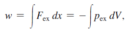

0915 物理化學

First law

- conversion 轉換
- open / closed 封閉 / isolated 孤立 system
    - closed system : 質量守恆
    - isolated system : 能量總和不變
- 彈力
    - 彈力與外力方向、位移方向 (x-x0) 相反
    - work = external force * displacement
- PV work
    - 
    - for ideal gases, the internal energy is only dependent on the temperature of the system.
    - at constant volume: no PV work
- the change of internal energy
    - 右下小標 : 固定什麼東西
    - constant volume molar heat capacity = dq / dt = 3/2 * R
        - for constant volume, there is no PV work
        - dU / dT = dq / dt = constant volume molar heat capacity
        - delta U = mole * C_{V, m} * T (for any ideal gases)
    - for diatomic gases
        - 原本有三種 mode (3-D 的速率)，雙原子還可以 rotate
            - (只有兩個維度的旋轉有意義，當旋轉軸定在鍵的軸上，旋轉是沒有意義的)
        - 因此多了兩個 mode
        - Energy will be shared out equally among all active modes
            - 這個叫做 equipartition theorem
    - for monatomic solid
        - Cv,m = 3R (背起來)
        - 因為每個 mode 用 RT，有三個 mode，用 3RT
            - RT = kinetic + potential energy
                - (gas 沒有 potential energy)
    - for 非 ideal gas 或 monatomic solid，只能查表
        - liquid 通常有較高的 heat capcity
- state variables & path variables (不重要)
    - state : 只跟起始狀態、結束狀態有關，中間發生什麼事情不重要，例如 enthalpy
        - 通常只 depend on state 的物理量，自己也是 state variable
    - path : 和中間發生什麼事有關，例如 work, heat
- reversible paths
    - 原本放了一堆砝碼在活塞上。
        - 砝碼拿下來之後，活塞會上升；砝碼放上去之後，活塞又回到原本的位置。
        - 重複無限多次依然如此，這就是 reversible path
    - 通常是因為變化量太小，如果你拿很大的砝碼，可能就不是 reversible
- equation of state
    - 我們常常把一些物理量用 state variables 表示，也就是將他寫成 state variables (如 P, V, T) 的函數
- 真實狀況
    - 考慮熱膨脹係數，不過因為差異太小，所以通常不看
    - var der Waals gas equation
        - ![]0915/5625946f0bc4d6a4390043aac3baef44.png)

        -