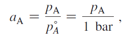
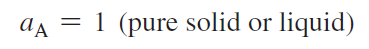

1013 Free Energy & Chemical Equilbrium

**# 學習策略**

- 複習
    -  (formula 3.35)

* * *

**# Chemical Potential : Partial molar Gibbs Energy**

- Chemical Potential ≡ molar Gibbs Energy (exactly, 這是定義)
    - 
    - 除了 A 物質以外，其他物質莫耳數維持恆定
    - 在平衡當中，我們只在乎比例，不在乎多寡
- **Fundamental equation of chemical thermodynamics**
    - 
    - 特例，定溫定壓下:
        - 
- **Standard Chemical Potential**
    - Gibbs Energy is Pressure dependent.
        - 
    - We would like to see if the reaction is spontaneous, which is not related to the amount.
        - 

* * *

**# Chemical Potential & Equilibrium**

- 一個化學反應用了多少量的物質，該怎麼跟另一個化學反應比較呢？
    - 這是化學計量問題，但是其實反應物消耗多少莫耳、生成物生成多少莫耳，只要除以反應係數，得到的莫耳數都是一樣的
    - 我們就可以用這個量去比較不同化學反應之間，莫耳數用量的多寡。
    - 定義 Xi
        - 
        - 概念釐清
            - dξ 是一個數字，不是什麼可以微分，然後又可以積分的那種函數啦
            - 反應物 A 之莫耳數 = dξ * 反應係數
- 判斷反應方向的公式 (Reaction Gibbs energy [definition])
    - 
    - =   
        - 狀態 B 的 Chemical Potential Summation - 狀態 A 的 Chemical Potential Summation

* * *

**#**  **Activity**

- **## Activity 是什麼？**
    - Activity 探討的是「非理想狀況下」，我們要如何修正我們的 G、H、S，讓他們更能夠預測反應進行
        - 我們可以大概理解成 Activity 就是反應的有效濃度、分壓。
        - 理想氣體：道耳頓分壓定律；理想溶劑：拉午耳定律；理想溶質：亨利定律；
    - 由於 Activity 跟濃度、溫度那些有很大的影響，所以我們會定義 Standard State 做為參考
        - 當達到 Standard State 的時候 Activity = 1 (定義)
    - 科學家希望定義在 Standard State 下，理想情況 Activity → 1
        - 這樣 Activity 可以方便的跟那些理想的定律做比較。
        - 所以針對不同的環境，就會有很多不一樣的 Standard State。
- **## Activity of Ideal Gases**
    - 定義 Standard State 為理想氣體分壓在 1 bar 下。(1 bar ≈ 1 atm)
        - 在 Standard State 下，Activity = 1
    - **### Activity of Ideal Gases**
        - 完美的情況，就是可以直接用分壓算。而理想氣體就是完美的情況。
        - 
    - **### Activity of Real Gases**
        - 不完美的情況，我們可以乘以常數去修正，反正可以查表。
        - 
- **## Activity of Pure Solid, Liquid**
    - 定義 Standard State 為純物質在總壓 1 bar 下。(1 bar ≈ 1 atm)
    - 沒理由純的東西，Activity 不是 1 吧？
    - 
- **## Activity of Solution**
    - Activity for Solution 就不好查表了，溫度、壓力、濃度不同，常數就不一樣，所以我們分成溶劑、溶質討論。
        - 如果你真的查的到溶液的 activity，你也可以這樣直接用 (紅框處代表會隨環境變因改變而變化)
            - 
    - **### Activity of Solvent**
        - 定義 Standard State 為 1 bar 下純的溶劑 (Pure liquid)。(1 bar ≈ 1 atm)
        - 最靠近 Standard State 的狀態，要不是純的溶劑，要不然就是超級稀薄溶液 (very dilute solution)。
            - 
        - 理想溶液的溶質 activity 就是莫耳分率。稀薄溶液 (Dilute solution) 也可用此估算
            - 
        - 越靠近理想狀態，我們越可以用莫耳分率去估算 Activity
            - 
            - 這告訴我們說，當我們溶劑的莫耳分率越接近 1 (越接近 Standard State)
            - 我們就越能夠用莫耳分率去估算 Activity
            - 例如: x = 0.8，就會比 x = 0.2 更適合用這個方式估計
        - 很不理想的狀態，就只能查表了
            - 
    - **### Activity of Solute (記得要用重量莫耳濃度)**
        - 定義 Standard State 為溶質重量莫耳濃度  molality = 1 M，但是表現卻像稀薄溶液的時候。這個狀態不可能存在。
            - mola**R**ity  = 體積莫耳濃度；mola**L**ity  = 重量莫耳濃度
            - 這個定義是為了要同時滿足單位換算、亨利定律 (稀薄溶液) 而做出的奇怪定義。
                - 亨利定律是用重量莫耳濃度定義的
        - 當我們越接近理想狀態的時候 (越稀薄)，我們可以用重量莫耳濃度去估算 activity
            - 
            - 越稀薄，就越能夠成立
                - 
            - 但是當溶液太稀薄 (1/1000 的差距)，其實重量莫耳濃度、體積莫耳濃度也不會差太多，我們可以亂帶體積莫耳濃度去估算。
                - 
        - 很不理想的狀態，就只能查表了
            - 

* * *

Biochemical Standard State

- H+ 的 Actvity 代 1

* * *

小故事: 為何液體的 activity 定義這麼詭異

- 因為科學家很討厭液體，液體很複雜，相對來說氣體就簡單很多
- 所以科學家一直在想辦法用液體的蒸氣去分析液體
    - 所以就有了針對溶劑的拉午耳定律、針對溶質的亨利定律。
    - 這兩個定律完美的讓科學家用蒸氣去分析液體，
    - 因此科學家把 activity 定義成這兩個定律的理想情況

* * *

* * *

沒用的東西了

# Equilibrium

- 判斷反應方向、是否達到平衡
    - 
    - 代反應商得到 Gibbs 的值 ≠ Standard Gibbis
    - 代平衡常數得到 Gibbs 的值＝ Standard Gibbis
        - 意思是指平衡常數到任意微小改變的新狀態
            - delta Gibbs = Gibbs - Standard Gibbs = 0
            - 熱力學 unfavorable
        - 可用此條件解平衡常數，或反過來解自由能
            - ![Image.png]1013_Review/2997ee85a331dfcb4542b3c5fcd2bf8f.png)
- 反應商可判斷反應方向，平衡常數永遠是定值。
    - 也許你加了什麼，溶液平衡時色彩變了，但平衡常數不變。
    - 
        - >1 : 向左
            - (注意，這和 K > 1 的概念是完全不一樣
                - Q >1 是探討反應方向
                - K>1 是探討熱力學上是否 favorable)

* * *

# Activity 公式證明

- for Ideal Gases
    - proof
        - 
        - 
        - 

* * *