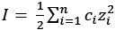

1013 Preview

- Keq: 受 T、本性影響
    - 正相關於 Delta Gibbs Energy
        - deltaT * S → T
        - Enthalpy → 本性
    - Keq 受溫度影響的定性分析
        - 通常
            - 吸熱方向的 Keq 值會變更大
            - (Kinetic) 吸熱反應的
        - 有時仍需考慮 entropy 變化
- Keq 不受濃度、壓力、催化劑影響
    - 催化劑影響的是活化能，是 Kinetic 問題
    - 也許某物濃度變了、顏色變了，但是定溫下算 Keq 一定都一樣
- Kinetic
    - 反應快慢 (不是反應常數)，注意，這同時考慮 Thermodynamic 和 Kinetic
        - 升溫，正逆反應常數均變大 (本來就是了)
        - 但是吸熱反應往往看起來變更快了
            - 這不只是因為反應常數變大
            - 也因為 more thermodynamically favorable

* * *

反應商可判斷反應方向

- Q < K : 向右
- Q > K : 向左

勒沙特列

- 反應必 against 變化 (多退少補)，但沒有辦法補償全部
- 定性分析
    - 液體
        - 調整某物濃度
            - (體積固定，因此探討莫耳數變化)
            - 增加 [A] → 所有物質濃度新平衡，抵抗 [A] 濃度上升，但 [A]' > [A]
            - 減少 [A] →  所有物質濃度新平衡，抵抗 [A] 濃度下降，但 [A]' < [A]
                - 可利用沉澱、酸鹼中和
            - 加同濃度的 [A] → 不改變平衡
                - (在高中可忽略其他物質濃度影響)
        - 稀釋液體
            - (莫耳數固定，因此探討體積變化)
            - 稀釋 → 往粒子數多的方向反應，補償濃度損失，但所有物質之濃度均下降
            - 只去水，不去別的物質 → 往粒子數少的方向反應，抵抗濃度增加，但所有物質之濃度均上升
    - 氣體
        - 調整某物分壓
            - (體積固定，因此探討莫耳數變化)
            - 增加 Pa → 所有物質分壓新平衡，抵抗 Pa 上升，但 Pa' > Pa
            - 減少 Pa → 所有物質分壓新平衡，抵抗 Pa 上升，但 Pa' < Pa
                - 可利用沉澱、酸鹼中和
            - 加同分壓的 Pa → 不改變平衡
                - (在高中可忽略其他物質濃度影響)
        - 操作體積
            - (莫耳數固定，因此探討體積變化)
            - 增加體積 → 往粒子數多的方向反應，補償分壓損失，但所有物質之分壓均下降
            - 減少體積 → 往粒子數少的方向反應，抵抗分壓增加，但所有物質之分壓均上升

* * *

在熱力學(thermodynamics)當中，「活性」指的是一個溶液中某溶質的「有效濃度」。會將活性與物質的濃度區別，是因為實際上當溶質的濃度較高時，其對於平衡常數(equilibrium constant)等影響，並非和濃度呈現線性關係。

這是由於電解質的周圍，因為靜電吸引力的緣故，因此會吸引一些與其相反電性的溶劑離子聚集在周圍，形成了離子氛(ionic atmosphere)。離子氛會抵消一些離子所帶來的電性，並且由於其圍繞在離子周為，阻擋了外界與離子的碰撞作用，因而影響到離子的反應性。並且當離子強度(ionic strength)越高時，離子氛所造成的效應也就會越明顯。

離子強度是溶液中各離子的濃度、以及其電荷的函數值，可以透過下列定義來進行計算：

其中c為離子的容積莫耳濃度，z 為離子的電荷。
也因為離子氛所造成的誤差，必須要透過活性係數(activity coefficient)的校正，才能夠得到比較好的結果。