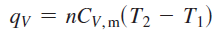

Review 1: Calculation of Uundefined Hundefined wundefined q

**# 定義與重要結論**

- 
- 
- 
- 
- Reversible
    - 系統壓力 = 外壓
- 關於 \Delta H 的推導
    - Reversible
        - 
        - 
    - At Constant Pressure
        - 
- 1 bar = 10^5 Pa
- R = 8.314 (J·K−1·mol−1)

* * *

**# Ideal Gases**

- **Heat 計算**
    - 定 p (定 p，則 H 就是 q)
        - 
        - 
    - 定 V
        - 
    - 定 T (理想氣體 U 不變)
        - 
        - 
- **Work 計算**
    - 
    - 定 p
        - 
    - 定 V (no pV work)
        - 
    - 定 T
        - 
- **ΔH 計算**
    - 任何情況皆可用
        - 
    - 定 P ，則 heat 就是 enthalpy
        - 
    - 定 V
    - 定 T
        - 
    - 其他
        - 
- **ΔU 計算**
    - 任何情況皆可用
        - 
    - 定 P
        - 
    - 定 V
        - 
    - 定 T
        - 

* * *

**# Solid, Liquid**

- **重要結論**
    - 基本上，因為 U = H - pV
    - 其實壓力改變不大的話
    - 體積改變量實在太小，因此 U = H (H 比較好算)
- **Heat 計算**
    - 定 p
        - 
    - 定 V
        - 
    - 定 T
        - 
- **Work 計算**
    - 定 p (定 p，則 H 就是 q)
        - 
    - 定 V
        - 
    - 定 T
        - 
    - 由於體積變化可忽略，因此三個都是 0
- **ΔH 計算**
    - 任何情況皆可用
        - 
    - 定 P 可用 q_p 算
        - 
    - 其他只能這樣算
        - Δ*H = *Δ*U -*  Δ*(**pV)*
- **ΔU 計算**
    - 任何情況皆可用
        - 
    - 定 P
        - 
    - 定 V
        - 

* * *