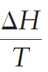

Review 2: Entropy

Entropy 是用來預測反應自發性的物理量，透過熱力學第二定律，將其與自發性、亂度連結。
但是這一點在藥學的物化一點也不重要。你只要知道他怎麼算，怎麼用在 G 的計算就好。

* * *

**# Entropy 計算**

- 
- 定溫下
    - 
- 只能用 reversible 算
    - 但 entropy 只和起始狀態還有結束狀態有關
    - 因此 rrreverisble process 的 entropy 計算:
        - 找起始狀態、結束狀態。算 reverisble 的熱
    - 如果你用 irreversible process 的 q_irrev 去算
        - 

* * *

**# Entropy 會隨著溫度、體積、壓力而改變**

- 定體積的話，Entropy 分子的 q 可換成 Delta H
    - 
- T 的變化
    - 由定義，我們可以用積分的方式算出來
    - 
- 體積、壓力的變化
    - 體積變化
        - 液體、固體
            - 
        - 氣體
            - 
            - at constant temp.
                - 
                - Because pV = nRT is a constant at constant temperature,
                - 
                - 
                - 
- 相變
    - 
    - 必須要是溫度不變的情況下才是 reversible
        - 不能算蒸發 entropy，只能算沸騰的
    - P 通常不變
        - 因此又可寫成
            - 

* * *

**# 熱力學第二定律**

- for any process
    - 
        - > 0 : irreversible
        - = 0 : reversible