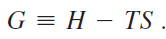
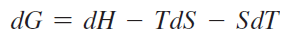
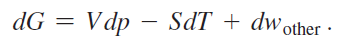
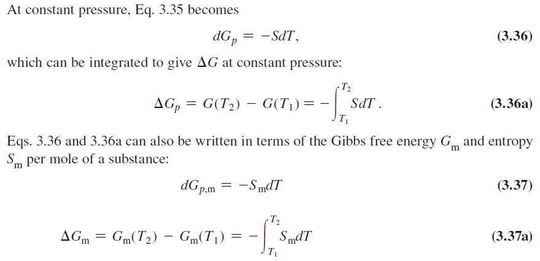
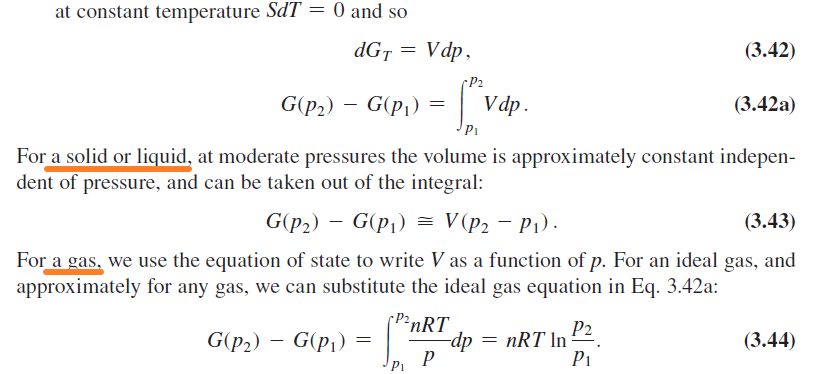
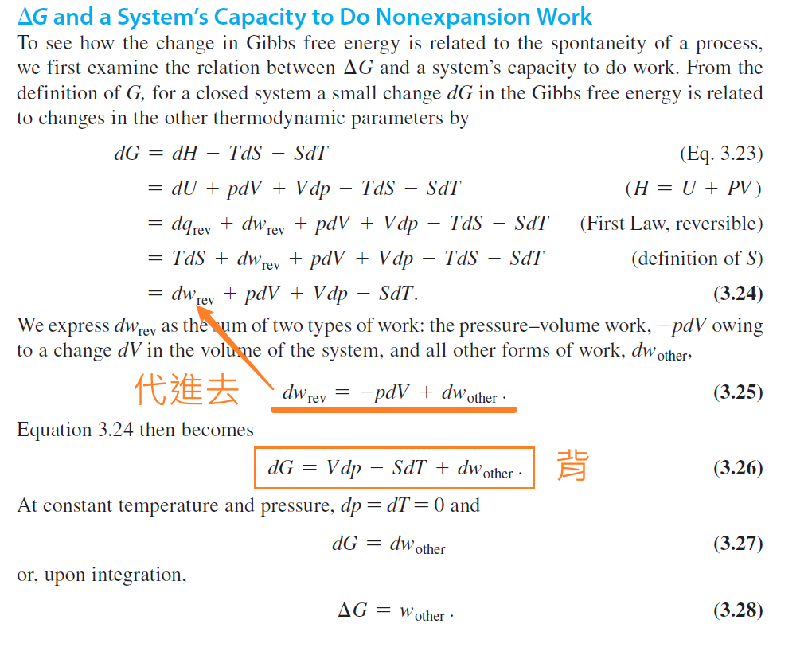

Review 4: Gibbs Free Energy

# G 的公式

- 
- 
- 
    - 亂記) 因為 p、T 固定，所以要 d 這個

* * *

**# Gibbs Energy 會隨著溫度、體積、壓力而改變**

- 隨溫度改變
    - 定壓下
        - 
    - 證明
        - 
- 隨壓力改變
    - 

* * *

公式推導

