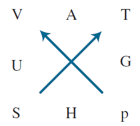
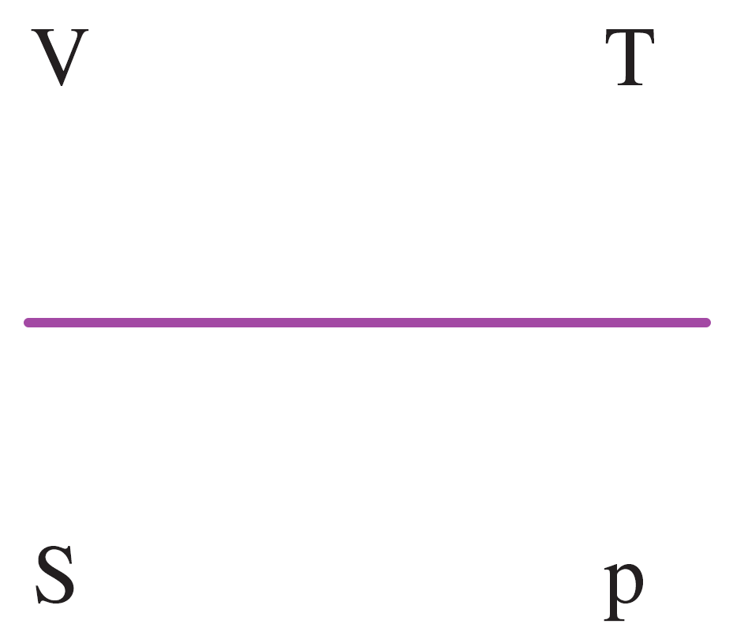

Review 5: The Thermodynamic Square

* * *

**# GAUH 的符號定義**

GAUH，就是圖形中的稜形，必可寫成  ⬜ ±  *pV*  = ⬜ ±  *TS*  的形式

- 至於 ⬜ 要放什麼，就是相鄰的兩個稜形頂點
- ⬜ 到底要放 ± pV，還是 ± TS
    - 我們以 G 為例，G 畫向 A 的直線，和 pV 這個連線平行
        - 因此 ⬜ 後面要放 ± pV，
        - 
- 如何判斷 ± pV / ± TS 的正負值
    - 我們仍以 G 為例，由於 G 畫向 A 的直線，和 pV 這個連線平行且同方向，因此取正
        - 
        - 
    - 舉另一個例子。G 畫向 H 的直線，和 TS 這個連線平行且反方向，因此取負
        - 

* * *

**# dG, dA, dU, dH 可由 pV, TS 微分表示**
GAUH，就是圖形中的稜形，其變化量形式必可寫成   *d *⬜*=*  *± **(pdV / Vdp)  ± (TdS / SdT)*  的形式

- 要 d 誰
    - d 「整個 square 中，相鄰的兩個頂點」(不是 GAUH 稜形，是整個 square)
        - 
- 知道 d 誰之後，等號右側兩項的正負獨立判定
    - 畫向之頂點，再往對角線前進，判斷對角線與 p→V、S→T 方向是否一致，方向一致取正，方向不同取負
    - 舉例 U = ± pdV ± TdS，我們先判斷 pdV 這一項，由於  對角線與 p→V 方向不同，故此項取負號
        - 綠色是我們現在畫的判斷線
        - 

* * *

**# S, T, P, V 偏微分關係的的轉換 : 彩謙版**
和前兩個不同，這次的主角是 STPV

- 我們可以畫這樣的分隔線
    - 
    - 
- 所以關係是？
    - 前面 \partial 符號自己補
    - 就是圖上面的樣子
        - 
    - 分子分母可以對調
        - 
- 定誰？
    - 定另一側的分母
        - 
- 正負號？
    - 史稱：看到直男正太，要平負心情（好甲喔幹，我到底為什麼會想到這種爛口訣）
    - 
    - 

* * *

**# S, T, P, V 偏微分關係的的轉換**

**## 如果 ****分子 → 分母 是水平方向，我們要做水平鏡射**

- 我們進行水平鏡射
    - 
- 分子水平鏡射對應的符號，就是等號右側的分子
    - (∂V/∂S)_p = (∂T/∂p)_?
    - 
- 水平鏡射，等號右側不需變號
- 等號右側定誰？
    - 在你畫水平鏡射的時候，就決定了。就是畫 L 的最後一個端點。
    - (∂V/∂S)_p = (∂T/∂p)_S
    - 

**## 如果 ****分子 → 分母 是垂直方向，我們要做垂直鏡射**

- 我們進行垂直鏡射
    - 
- 分子垂直鏡射對應的符號，就是等號右側的分子
    - 
- **垂直鏡射，等號右側需要變號**
- 等號右側定誰？
    - 在你畫垂直鏡射的時候，就決定了。就是畫 L 的最後一個端點。
        - (∂S/∂P)_T = (∂V/∂T)_p
        - 

