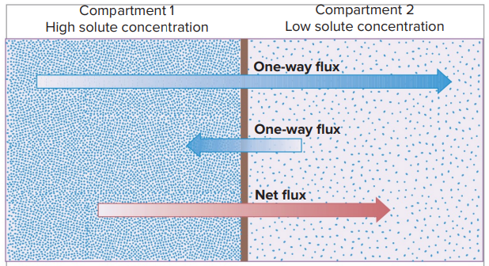
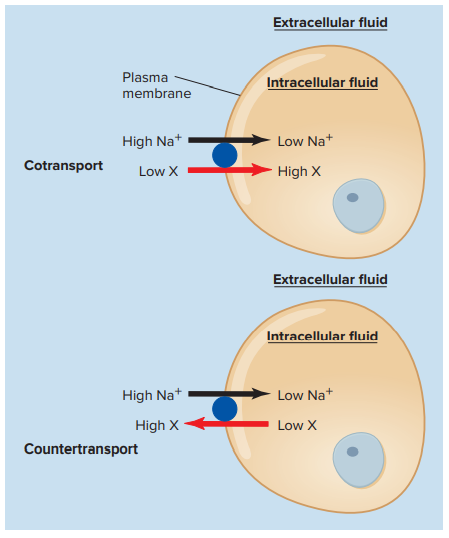
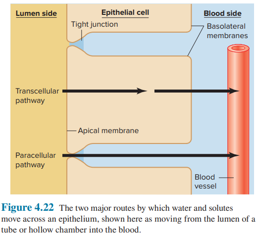
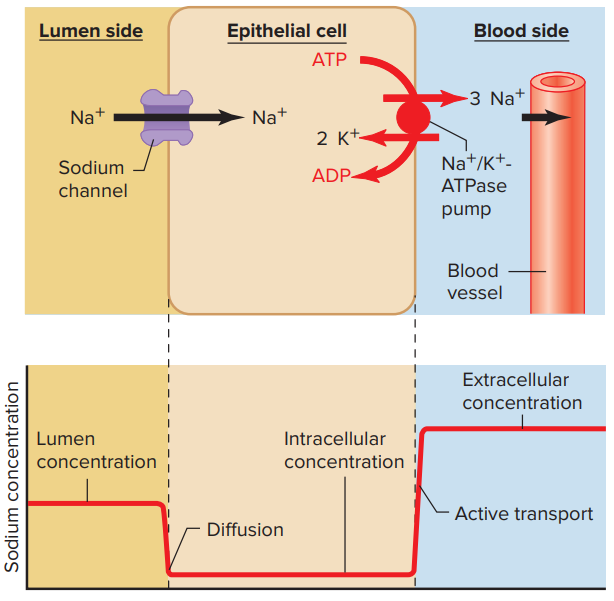
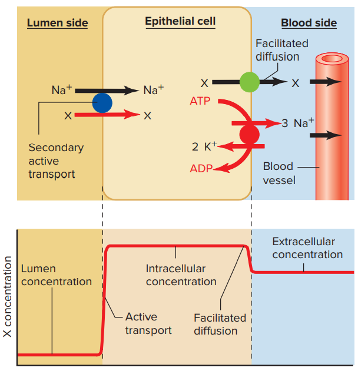
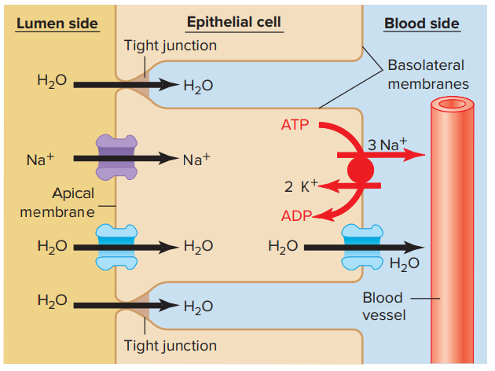

# 細胞膜與物質的移動

## 1. 擴散

- 擴散運動得以發生，是為了要讓亂度達到最大 (熱力學第二定律)
- 通量 flux : 單位時間內，物質通過一個表面的數量
  - 有方向性。如下圖，通過一個表面的 flux 有兩個，彼此反向。
  - 
- 擴散平衡 : net flux = 0
- 擴散相關定律
  - flux 的大小與通透性、擴散面積、濃度梯度差成正比 (Fick's first law)
    - $J=PA(C_0-C_i)$
    - 這是針對生物學的修改版
  - 擴散時間與擴散距離平方成正比 (不知道什麼定理)

### 離子的擴散

- 更多的內容，詳見膜電位的計算
- 上述的擴散，並沒有考慮電荷平衡的影響，因此並不適用於離子移動的計算
- 離子的在細胞膜磷脂質雙層擴散，需要經由通道蛋白
- 離子在膜之間的 flux，同時由電位梯度、濃度梯度決定
- 離子在膜之間移動，會產生膜電位 (Membrane potential)

## 2. 不同的運輸機制

### 小分子 Transport 方式的分類

- 簡單擴散
  - 非極性物質直接穿透脂雙層，例如脂類、類固醇、氧氣
- 促進性擴散
  - 通道蛋白促進性擴散
  - 載體蛋白促進性擴散
- 主動運輸
  - 初級主動運輸 : 直接利用 ATP 造成蛋白質構型改變
  - 次級主動運輸 : 利用另一個分子的濃度梯度進行運輸

### 名詞解釋

- Transport proteins 包含 channel proteins, carrier proteins
  - 通道蛋白 Channel proteins : 不需要構型改變就能夠運輸物質
    - 如水通道蛋白 (aquaporins)、部分離子亦藉由通道蛋白運輸
  - 載體蛋白 Carrier proteins : 需要構型改變才能運輸物質
    - 主動運輸必為 carrier proteins
    - 但 carrier proteins 不一定需要耗能，如 GLUT 就不需要耗能
- Mediated Transport = 要使用載體蛋白的運輸
  - 使用通道的促進性擴散不屬於此類

### Mediated Transport

- Mediated Transport = 要使用載體蛋白的運輸
- 與作用擴散相比，Mediated Transport 會有飽和現象
  - 通道蛋白的飽和現象較不明顯 (只有在濃度梯度差異極大時才會有飽和現象)
  - 載體蛋白有明顯的飽和現象
- 主要由四個因素決定 Mediated Transport 的程度
  - 溶質濃度
  - Transporters 對於溶質的親合性
  - Transporters 的數量
  - Transporters 蛋白構型改變所需要花費的時間

#### 主動運輸

- 初級主動運輸 : 直接利用 ATP 造成蛋白質構型改變
  - 最經典的例子就是鈉鉀幫浦
  - 稍微記一下兩個離子的濃度差異 (外 / 內)
    - 鈉離子 : 145 mM / 15 mM
    - 鉀離子 : 5 mM / 150 mM
- 次級主動運輸 : 利用另一個分子的濃度梯度進行運輸，因此必有兩個 binding sites
  - 又可分為 cotransport 或 countertransport
  - 最常見的為使用 Na^+^ 梯度 (細胞外高，細胞內低。此梯度由鈉鉀幫浦控制)
    - 將物質利用 cotransport 送入細胞內
    - 將物質利用 countertransport 送出細胞
    - 

## 3. 滲透

### 滲透壓

- 一個溶液的滲透壓為依數性質 (Colligative properties)
- 在生物體中，我們可以用 van't Hoff equation 去計算溶液滲透壓

### 生理學常用的物理量 - Osmolarity

- 針對「一整個溶液系統」的物理量
- 回想一下針對一種物質，其對溶液貢獻的滲透壓大概這樣算
  - $\pi = C_{M}RT$
  - 注意
    - 不同物質的滲透壓可相加
    - 有些物質會解離，所以要乘以凡特荷夫因子
    - 針對非理想溶液，我們需要
- 將溶液中，所有對滲透壓有貢獻的物質的濃度經修正系數修正後加起來，就是 Osmolarity
  - 因此 Osmolarity 的定義長成以下的樣子
    - 
    - φ (phi) 是針對非理想溶液中的修正系數，每個物質不同
    - n 類似凡特荷夫因子，每個物質不同
    - C 為物質濃度，當然不同物質濃度不同
  - 把每個物質修正後的量值加總，就是所有物質對於這個溶液貢獻的 Osmolarity
  - 我們可以直接拿 Osmolarity 代入 $\pi = C_{M}RT$ 中的 C~M~，就會得到正確的滲透壓 
  - 單位為 Osm / L

### Tonicity - 等張、高張、低張溶液

- Tonicity 是一種定性的溶液性質，一種溶液的 Tonicity 可以是下列三種情形
  - 等張 (isotonic)、高張 (hypertonic)、低張 (hypotonic)
- 定義
  - 把細胞放在此溶液中，不會膨脹也不會縮水，就叫等張溶液 (isotonic solution)
  - 相反的，細胞會縮水，此溶液就叫做高張 (hypertonic)
  - 細胞會膨脹，則此溶液叫做低張 (hypotonic)
- 注意，等張、高張、低張並不是直接由滲透壓決定
  - 原因 : 細胞裡面物質的濃度並不是恆定不變、細胞膜不是只對水具有通透性
  - 無法通透細胞膜的物質，才會決定 Tonicity (例如澱粉)
  - 可以快速通透的物質，由於其濃度快速與細胞外達到平衡，因此不會決定 Tonicity
  - Na^+^, K^+^, Cl^-^ 等離子，由於其在細胞內的濃度恆定，因此亦會決定 Tonicity

## 4. Bulk Transport

Bulk transport 通常具有專一性，例如神經囊泡的釋出、膽固醇的吸收

- 胞吞 endocytosis
  - 胞飲 pinocytosis
  - 吞噬 phagocytosis
  - 受體媒介胞吞 receptor-mediated endocytosis
- 胞吐 exodocytosis

## 5. Epithelial Transport

- 將物質從 Lumen side 運輸到 Blood side 的方法有兩種
  - Paracellular pathway
    - 被上皮細胞間的 Tight Junction 限制，效率不高
  - Transcellular pathway
  - 

- 上皮細胞具有 Polarity，因此 Lumen side 和 Blood side 的細胞膜差很多

### 幾種上皮細胞運輸物質的例子

- 離子從管腔吸收
  - 
- 葡萄糖等有機物質從管腔吸收
  - 
- 水從管腔吸收
  - 