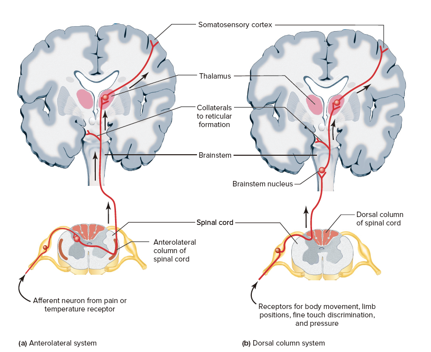
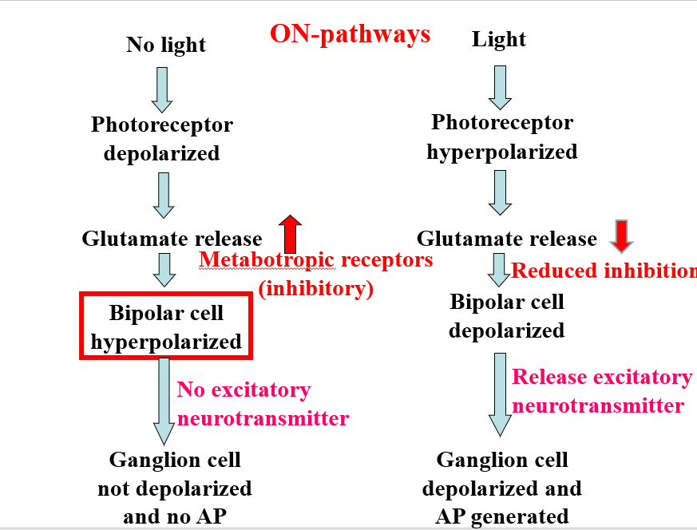
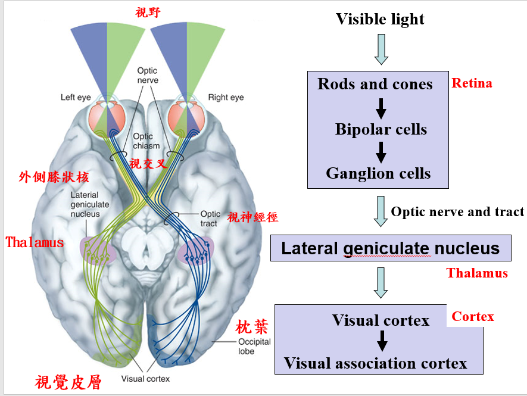
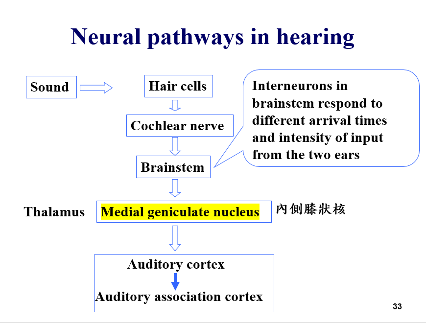
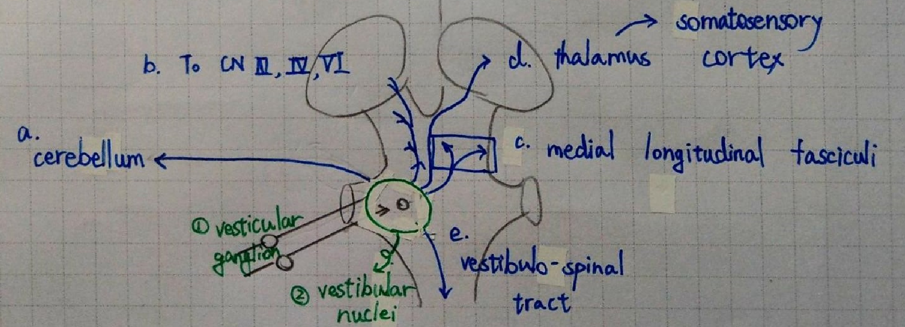

CH 07#2. 體感覺傳遞

**體感覺傳遞**

- Anterolateral system 在腹側的某一區域開始往上直直傳送
    - 痛覺與冷熱覺
    - 第一個突觸在脊髓裡面，且在第二個神經元會 cross 到另一邊 (也就是在脊髓換邊)
    - 第二個突觸位於視丘 (Thalamus)
- Dorsal column system 在背側的某一區域開始往上直直傳送
    - 痛覺與冷熱覺外的感覺
    - 第一個突觸在腦幹裡面，且在第二個神經元會 cross 到另一邊 (也就是在腦幹換邊)
    - 第二個突觸位於視丘 (Thalamus)
- 共通點
    - 都會換邊
    - 記住，感覺神經元有感覺神經節，屬於 PNS。
    - 相較之下，運動神經元沒有形成神經節，運動神經元本體位在 CNS 當中。
    - 位於臉部、頭部的體感覺並不會透過脊髓傳送
        - 他們直接透過 cranial nerve 傳送感覺到腦幹

* * *

**視覺傳遞**

- 共通點
    - 沒有光的時候，視細胞去極化，釋放 Glutamate
    - Metabotropic receptor 和 Ionotropic receptor 都是接收 Glutamate
- ON-Pathway
    - Metabotropic receptor 接收 Glutamate 會使 Bipolar cells 過極化
    - 有光，就有動作電位 (ON)
- OFF-Pathway
    - Ionotropic receptor 接收 Glutamate 會使 Bipolar cells 去極化
    - 有光，就沒有動作電位 (OFF)

- 每個眼睛右半邊視野的視神經，都「會合」到右邊的 Optic tract，左邊也亦然。
- 也就是說，有些視神經會 cross 另一邊，有些不會。
- 另外，中心視野會重複，也就是右眼的左邊、左眼的右邊，
    - 這兩個視野會重疊，也就是 binocular vision。
    - 只能被單眼看到的視野，稱為 monocular vision
- 視交叉 (也就是神經交叉的那一個點) 在腦的底部，交叉後往另一個方向的路徑，稱作 Optic tract

* * *

**聽覺的傳遞**

- 視覺是外側膝狀核，聽覺是內側膝狀核

* * *

**前庭神經傳遞**

- a. 協調動作平衡
- b. 前庭動眼反射
- c. 似乎可以到視丘
- d. 從視丘可以到皮質層
- e. 可以往下透過 descending pathway 協調肢體運動