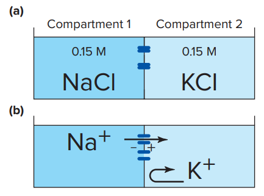

# 膜電位

## 1. 靜止膜電位

脂雙層結構難以帶電，形成高電阻區域，脂雙層的內外側因此有機會形成膜電位差異。膜電位的測量，以細胞外作為參考電極 (負極)，細胞內作為測量電極 (正極)，測量細胞內與細胞外的電位差。

### 靜止膜電位的成因

考慮只對鈉離子通透的半透膜，若左邊的鈉離子濃度梯度較高，則會流向右邊。右邊鈉離子逐漸變多時候，由於鈉離子帶正電，因此右邊的 Compartment 的電位較高。

然而，正電會互相排斥，因此當右方的 Compartment 帶的正電越多，鈉離子流過去的比例就會越少，因此右邊的電位不會無限上升。最終，兩邊的鈉離子比例會趨近於一個定值，這時候濃度梯度造成的 flux 和電位梯度造成的 flux 互相抵消。除了離子梯度為定值外，**電位梯度也趨近於一個定值，這稱作平衡膜電位**。

值得提醒的是，上圖的情況並不合理。兩邊溶液是不同溶液系統，而溶液系統必須要電中性，因此上圖中的鈉離子若因為濃度梯度而流動，將會破壞電中性原理。但是在一般情況下，細胞內不會只有鈉離子。**當我們把左邊所有離子帶的電荷加起來，仍滿足電中性原理，右方亦然**。

另一方面，正負離子在溶液系統中會互相配對。**脂雙層內外的兩溶液，電荷也會互相配對，形成如下圖般的電荷分布情況**。由於電荷傾向於在兩邊擴散 (為了使亂度達到最大)，因此此配對可以確保膜電位形成的同時，也有一些能量可以穩定這些造成膜電位的電荷。

最後，**參與上述平衡的電荷數量相對於總電荷來說非常少**。藉由形成下圖中的薄薄一層殼 (shell) 的結構，內外兩個不同電性的殼得以配對，而雙方的吸引力可以提供穩定膜電位的能量。此配對關係同時亦確保只有非常少的離子需要被 localized 以貢獻膜電位，其他的離子可以以最大亂度的方式繼續在兩個系統之間流通。(下圖離子數量並不合理。下圖唯一的重點，是不同電性的電荷配對，在細胞膜的內外形成一層 shell 的構造)

### 單一離子的平衡膜電位計算

詳細推導內容可參考物化課本 7-3 Transmembrane Equilibria。

根據上述平衡膜電位的敘述，我們知道平衡膜電位會用於抵消濃度梯度造成的 flux。當一種離子達到其平衡膜電位時，濃度梯度造成的 flux 和電位梯度造成的 flux 互相抵消。在細胞生理學中，我們通常會先知道膜之間的濃度梯度，**我們可以用 Nernst equation，利用單一離子的濃度梯度計算單一離子的平衡膜電位。**

$$\displaystyle E_{ion} = \frac{61}{Z}log(\frac{C_{out}}{C_{in}})$$

其中 61 是常數 (體溫 37 度、Z 是電荷數，正電代正、負電代負)

正負號該怎麼記？很簡單，記得鈉離子算出來的平衡膜電位 > 0，鉀離子算出來的平衡膜電位 < 0。

### 多離子的平衡膜電位計算

多離子的平衡膜電位，需要考慮不同離子之間通透性的差異。若某一離子的通透性越大，則整個細胞的膜電位，會較傾向於此離子的平衡膜電位。

上述關係式被稱為 Goldman-Hodgkin-Katz equation。

例如 : 鈉離子的平衡膜電位接近 + 60 mV，鉀離子的平衡膜電位接近 - 90 mV，鉀離子的通透性遠大於其他離子，因此整個細胞的平衡膜電位很接近鉀離子的平衡膜電位。(可以理解成幾乎全由鉀離子決定整個細胞的平衡膜電位)

### 細胞的平衡膜電位成因

- 穩定的離子濃度梯度差，造成穩定的平衡膜電位產生。
  - 高通透性的離子，對於整個細胞的平衡膜電位影響較大。
- Electrogenic pump (貢獻非常小)
  - 例如鈉鉀幫浦。三鈉出，二鉀進。會造成部分的正電在細胞外。

## 2. Graded vs. Action Potential

### 基本名詞

- Depolarizing : 靜止膜電位 → 0
- Overshoot : 0 → 極大值
- Repolarizing : 極大值 → 0
- Hyperpolarizing : 0 → 靜止膜電位

### Graded Potential

- 刺激的大小，會影響到電位變化的大小
  - 
- 傳遞距離非常小，因為細胞膜對離子的通透性滿高的
  - 
- Graded Potential 可以是去極化，或是過極化 (例如視覺受器)
  - 去極化通常不會 > 0
- 常見於感覺受器

### Action Potential

- 全有全無律 → 只要到達閾值，刺激大小並不會影響到電位的大小
- 相較於只能產生 Graded Potential 的細胞，可以產生動作電位的細胞，多了「電位敏感通道」
- 只會去極化，且膜電位會短暫 > 0。
- 傳遞距離很長，因為傳遞途徑都有電位敏感通道

### 不反應期 Refractory period

- 電位敏感型通道的特性
  - 電位敏感型鈉離子通道
    - 很快開啟，也很快進入 inactive 狀態
    - Inactive 狀態時，不能重新開啟
    - 需要經過一段時間才能從 inactive 狀態回到 resting 狀態
  - 電位敏感型鉀離子通道
    - 很慢開啟，但也很慢關閉
  - 
- 絕對不反應期 absolute refractory period
  - 幾乎所有 Voltage-gated Na^+^ channel 在 inactive 的狀態時
- 相對不反應期 relative refractory period
  - 一部分的 Voltage-gated Na^+^ channel 回到 resting 狀態時
  - 這時候由於有一些 Voltage-gated Na^+^ channel 還在 inactive 狀態，因此需要更大的刺激才能再次激起動作電位。
- 神經的單向傳遞
  - 動作電位總是從樹突或是軸丘開始，往軸突末端前進
  - 因為剛發生完動作電位的地方會進入絕對不反應期，因此動作電位沒有辦法往後走，只能往前走。
  - 
  - 由於肌肉的動作電位通常在細胞中間被激發，因此動作電位可以往細胞兩端前進

