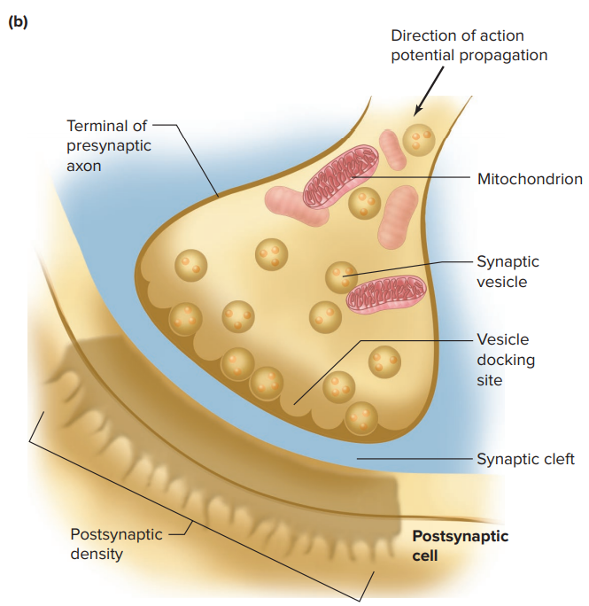
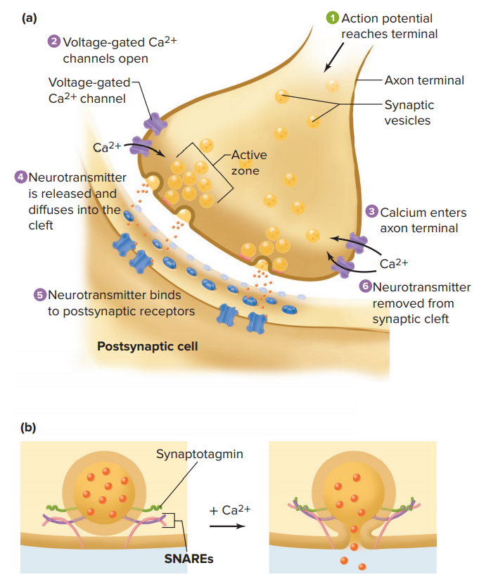

# 突觸

突觸可分為化學突觸、電突觸。由於脊椎動物幾乎只用化學突觸，故省略電突觸。

## 1. 神經遞質的釋放

### 突觸的解剖構造

- 突觸前細胞
  - 軸突末端富含粒線體、突觸小泡
    - 粒線體可提供能量給 Motor proteins 以負責突觸小泡運輸
    - 突觸小泡在細胞膜前面排排站好，稱為 Active zones
  - 只有軸突末端才會有電位敏感型 Ca^2+^ 通道
  - 軸突末端細胞膜有 SNAREs，突觸小泡上有 Synaptotagmin，兩者交互作用，釋放小泡
- 突觸後細胞
  - 與軸突末端接近的區域，形成 Postsynaptic density，富含膜蛋白

### 突觸小泡釋放過程

太簡單就不敘述了，直接看圖。唯一值得提的，是 SNAREs 和 Synaptotagmin 碰觸後，還需要 Ca^2+^ 的參與，使複合體構型改變，進而使突觸小泡和細胞膜融合。

### 神經遞質的回收或去活化

- 再回收 Reuptake (主動運輸回去突觸前細胞膜)
- 運輸到附近的 Glial cells 以進行分解
- 快速擴散到附近
- 被酵素分解或轉為非活性物質

## 突觸後細胞的活化

依據突觸後神經元對於此動作電位的反應，可將動作電位分成兩種 : Excitatory / Inhibitory。前者使突觸後細胞去極化，後者使突觸後細胞過極化。

- Excitatory postsynaptic potentials (EPSP)
  - 通常會打開同時可讓 Na^+^, K^+^ 通過的正離子通道 (對於兩者的差異不具選擇性)
    - Na^+^ : 大量流入細胞內
    - K^+^ : 由於細胞膜電位接近 K^+^ 單一離子平衡膜電位，因此流動性降低。
- Inhibitory postsynaptic potentials (IPSP)
  - 通常會打開 Cl^-^ 或 K^+^ 通道，使突觸後細胞過極化
  - 亦有可能只是穩定膜電位，使其不容易去極化
- 一個神經元可同時接收 EPSP、IPSP，並對其做整合
  - 若 EPSP > IPSP，則可能產生動作電位。反之，則是抑制訊號傳遞。

