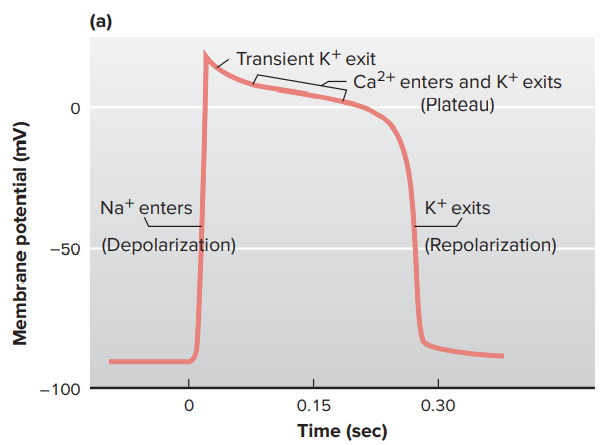

# 心肌細胞動作電位

- 特殊細胞結構
  - Gap junctions : 使得去極化可以快速傳播
  - desmosome
- 與骨骼肌細胞比較
  - 靜止狀態
    - K+ 通透性遠高於 Na+，因此主要由鉀離子決定平衡膜電位。 (同肌肉細胞)
  - 動作電位發生時
    - 電位敏感型 Na+ channel，使細胞去極化。 (同肌肉細胞)
    - Na+ channel 開啟速度非常短暫 (transient)，很快 inactivate。(同肌肉細胞)
    - **Na+ channel 關閉後，細胞並不會馬上回到靜止膜電位**。(不同於肌肉細胞)
      - 由於膜電位沒有快速恢復，因此需要一段時間才能進行下一次的動作電位
      - 換句話說，有非常長的不反應期，此機制確保心肌不會抽筋

## 收縮性心肌細胞的去極化過程

- 收到傳導組織的電訊號，電位敏感型 Na+ channel，使細胞去極化。
- Na+ channel 開啟速度非常短暫 (transient)，很快 inactivate。
- 特殊的 K+ channel 開啟後又快速關閉，使膜電位接近 0 mV。
  - 此 K+ channel 不同於一般肌肉細胞，關閉速度非常快。
- 細胞膜電位維持在 0 mV 的 **Plateau**，有以下原因
  - K+ 通透性下降，平衡膜電位不再由 K+ 決定
  - **L-type Ca2+ channel 開啟，Ca2+ 流入細胞**，細胞因此能維持在相對正的膜電位
    - L-type Ca2+ channel : 反應速度慢，關閉速度也慢。又稱作 DHP channels
- 最終，L-type Ca2+ channel 也慢慢關閉，以下機制使細胞再極化
  - L-type Ca2+ channel 關閉，正離子不再流入
  - 另一種 K+ channel 開啟 (慢開慢關型)，使細胞再極化。 (似肌肉細胞再極化方式)
- 膜電位變化趨勢
  - 
- 離子通透性變化趨勢
  - 

## Nodal cells 的膜電位變化

- 特性 : Pacemaker Potential (眾多原因使細胞能夠週期性的去極化)
  - SA node 和 AV node 都有這種電位變化趨勢，但 SA node 到達閾值速度較快，因此一般而言，都是 SA node 控制整個心跳的速率。
- 為何會週期性去極化 : 離子通透性變化
  - 起點 : 再極化過後
  - K+ channel 通透性下降 : 隨著再極化結束，再極化時開啟的 K+ channel 也慢慢關閉
    - (比較) 其他肌肉細胞再極化後，K+ channel 始終保持在很高的通透性
  - **F-type channel 開啟 : 在膜電位為負值時，會開啟通道使 Na+ 進入**
    - 此通道開啟後，會使膜電位稍微上升，慢慢接近 -50 mV 左右
    - 此通道對陽離子沒有選擇性，但主要是讓 Na+ 進入
    - F = funny，因為此通道在膜電位為負值時才會開啟，非常有趣
    - aka. Hyperpolarization-activated cyclic nucleotide-gated [HCN] channels
      - 為 Class 0 抗心律不整藥 (ivabradine) 所抑制的通道
  - **T-type Ca2+ channel 開啟 : Ca2+ 流入，使膜電位到達門檻**
    - 在 F-type 作用後，細胞的膜電位仍維持在負值，但是達到 -50 mV 左右
    - 在 -50 mV 附近，T-type Ca2+ channel 會開啟
    - 大量 Ca2+ 流入，最後使得細胞達到動作電位門檻
  - **到達閾值後，L-type Ca2+ channel 開啟。Ca2+ 大量流入，完成去極化**
    - 並不是 Na+ 大量流入造成去極化
      - 因為Nodal cells 很少電位敏感型的 Na+ channel
    - L-type Ca2+ channel 去極化的速度較慢，因此動作電位傳遞速度較慢
  - L-type Ca2+ channel 開啟，使得動作電位能夠維持一段時間
  - K+ channel 開啟 (慢開慢關型)，使細胞再極化。
- 膜電位變化趨勢
  - 
- 離子通透性變化趨勢
  - 

## 心肌細胞的收縮 [施工中]

- 心肌的收縮機制
  - 動作電位
  - Ca2+ 進入細胞
  - Ca2+ 促使 Sarcoplasmic reticulum (SR, 類似肌肉細胞的ER) 釋放更多的 Ca2+ (Ca2+ binding to Ryanodine receptor channels, RyR on SR)
  - Ca2+ spark
  - Ca2+ binds to troponin
  - Ca2+ unbinds to troponin (準備結束收縮)
  - 耗能的情況下 Ca2+ 重新回到 SR，Na+ - Ca2+ exchange on cellular membrane

