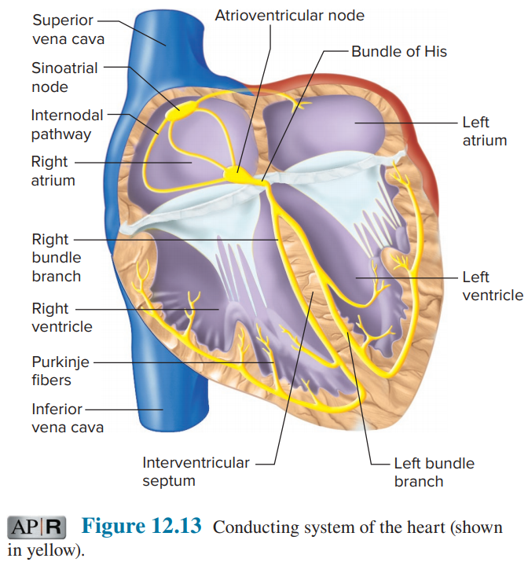
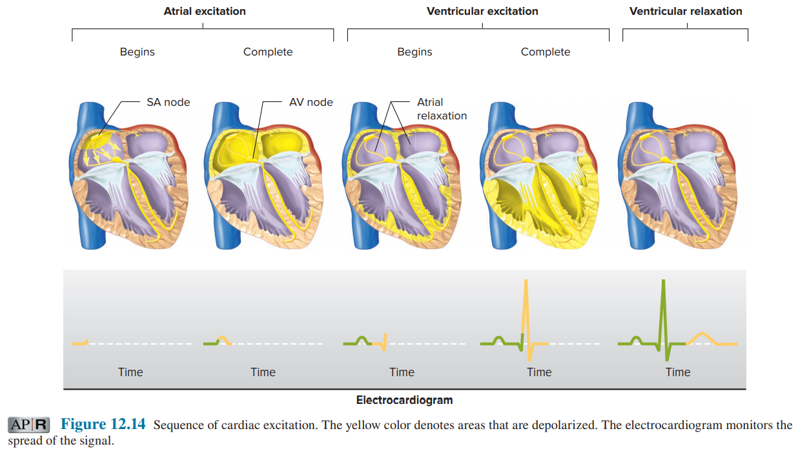

# 心臟傳導

## 1. 心臟傳導生理原則

- 以下均不考慮病理狀況
- 傳導系統是特化的心肌。傳導心肌細胞只負責傳導、其他心肌細胞只負責收縮。
  - 不同部分的心肌細胞，其細胞表面具有不同的離子通道，其膜電位變化方式也不大相同。
- SA Node 放電的速度比其他心肌細胞都快，所以主宰整個心臟的跳動頻率
  - 直接決定心跳速率
- 電訊號傳遞到心室前，一定會經過 AV Node，所以會延遲 0.1 秒鐘

## 2. 心臟傳導的過程

- 一個 Cycle 中，電訊號的傳遞路徑
  - 心房
    - SA node → Internodal pathway → AV node
  - 心室
    - AV node → Bundle of His (左右兩分支) → Apex of ventricular septum
    - Purkinje fibers (左右兩分支) → Ventricular myocardial cells
  - 

- 心臟傳導重要事件
  - SA Node 去極化 : P 波出現
  - 在極短時間內，收縮訊號傳遞到整個心房，並收斂在 AV Node
  - 在 AV Node 延遲 0.1 秒後，訊號沿著 Bundle of His 傳遞到心室

