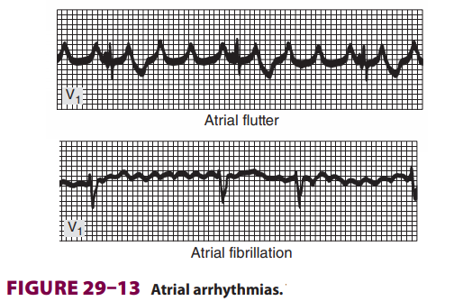
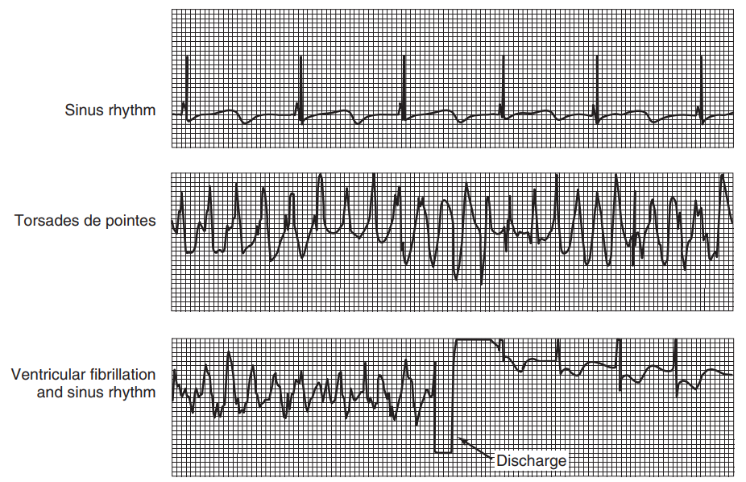

# 心律不整

Ganong's (26e) 列舉了下列常見的心律不整：

- Abnormal Pacemaker (Heart Block)
  - 當心房到心室的傳導受阻時，從 SA Node 發出的電訊號不再主宰心室收縮。這時候受阻的 AV Node 或 AV Node 以下的傳導組織，可以變成不正常的 Pacemaker。
  - **First-degree / Second-degree / Third-degree (Completely blocked) block**
- Ectopic foci of excitation
- Reentry
- **Atrial fibrillation / Atrial flutter**
- Ventricular arrhythmias
  - **Paroxysmal ventricular tachycardia**
  - **Torsades de pointes** (QRS Complex 會呈現多型性，每次 Cycle 都長得不一樣)
  - **Ventricular fibrillation**
- Long QT syndrome
- Accelerated AV conduction
  - WPW Syndrome

## Atrial Fibrillation / Atrial flutter

- AFib ECG
  - 沒有明顯的 Sinus P wave (SA Node discharge 受到影響)
  - 會有很多類似 P wave 的亂七八糟小波峰不斷出現在 QRS Complex 的前方
    - 不正常的迴路形成，一直放電，導致心房收縮的波峰持續出現
  - QRS 波型也不正常，最重要的是 RR Interval 不固定
    - 每次心室收縮的時間間隔是不固定的
- Atrial flutter ECG
  - ECG 中仍能辨識出 P 波，但是較為鋸齒狀
    - 不同於 Af，Af 根本辨識不出 P 波 (比較像一連串的小波峰)
  - 由於 P 波正常，所以電流會沿著 AV Node 進入心室
  - 通常與  2:1 or greater AV block 相關
- 
- AFib 病理機制 (目前未明白)
  - The cause of atrial fibrillation is still a matter of debate, but in most cases it appears to be due to **multiple concurrently circulating reentrant excitation waves in both atria**. However, some cases of paroxysmal atrial fibrillation seem to be produced by discharge of one or more ectopic foci. Many of these foci appear to be located in the pulmonary veins as much as 4 cm from the heart. Atrial muscle fibers extend along the pulmonary veins and are the origin of these discharges. (Ganong's, 26e)
- Paroxysmal atrial tachycardia / flutter 會使心室收縮速度過快，可能會造成 Heart failure

## Ventricular arrhythmias

## Accelerated AV conduction

- Pre-excitation syndrome (以 WPW Syndrome 舉例)
  - 心臟多了一條 Pathway，可以繞過 AV Node，將訊號傳遞到 Bundle of His 或直接刺激心室的心肌。只要繞過了 AV Node，就不會延遲 0.1 秒鐘，於是心房和心室收縮的速率同步，心跳會變很快。
  - EKG 上面可看到 QRS Complex 有典型的 Delta wave、較短的 P-R Interval、較寬的 QRS interval
  - M: 因為有另一條路徑造成了小小的波峰，稍微比正常的 QRS 波早一點，疊家在一起，就出現了 Delta wave。沒有 Delta wave 的話，Q 波應該會直衝上頂端。
  - [UpToDate 介紹](https://www.uptodate.com/contents/anatomy-pathophysiology-and-localization-of-accessory-pathways-in-the-preexcitation-syndrome)

## 治療手段

- 抗心律不整藥物
- 植入裝置 (心律調節器、心臟內去顫器)
- 經導管電燒術 (通常搭配心臟電氣生理檢查完成)
- 外科手術
[[19_The_Heart]]

## 補充

- Cardiac arrest 的定義
  - Cardiac arrest 是指心臟傳導異常，導致心臟無法適當地扮演「幫浦」這個角色，因此其他器官會開始缺氧。**Cardiac arrest 可以是致命的心律不整或是心跳停止。** (M: 不要把 Cardiac arrest 翻成心臟驟停)
  - 在這樣的定義下，VF/VT/Asystole 都可以算是 Cardiac arrest (?)
  - [參考資料 : 美國心臟協會](https://www.heart.org/en/health-topics/cardiac-arrest/about-cardiac-arrest)
- Asystole 定義
  - Asystole 是指心室不收縮，通常是 VF / VT 惡化的結果。在 ECG 上面，可以看到絕望的水平線 (近乎完全沒有起伏)。
  - [參考資料 : ProACLS](https://www.proacls.com/wiki/ekg-rhythms/asystole-ecg/)

