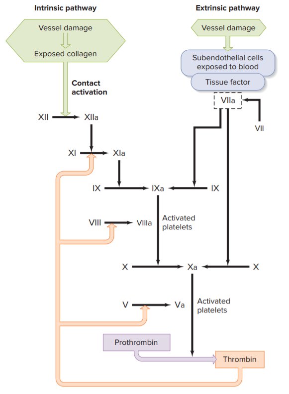

# 止血

## 1. 止血的重要關鍵

- Vessel constriction
- Platelet plug formation
- Blood coagulation

## 2. 凝血因子

百分之一千背不起來的東西，但是我們注意一些重要的凝血因子。

- 肝素 (Heparin) 使 **Antithrombin III** 活化，進而抑制 **Factor X (10)** 和其他的蛋白酶
- Direct thrombin inhibitors (DTIs) 可直接抑制 Thrombin
- Warfarin 為 Vitamin K 的拮抗劑 (Vitamin K 參與 Factor II, VII, IX, X 的作用)
- 最常見的血友病為 **Factor VIII (8)** 的缺乏

- 3-Step of Hemostasis
  - Vessel constriction
    - 多種因子會造成 vessel constriction
      - 主要為 local mediators (來自上皮或血液)
      - 血小板形成過程，也會使 vessel constriction 加劇
  - Platelet plug formation
    - 過程
      - collagen exposed
      - forming vW bridge, fibrinogen bridge
      - 血小板活化與聚集
        - 釋放化學因子 (chemical mediators)：5-HT、ADP
        - 釋放 thromboxane A2 (TXA2)
      - chemical mediators、thromboxane A2 均可產生 vasoconstriction、positive feedback
    - 抑制：鄰近的上皮細胞分泌 PGI2 (prostacyclin)、NO
  - Blood coagulation
    - Pathways
      - Intrinsic pathway (內在: 所有凝血所需物質都在血液中)
        - contact activation (沒有中文)
        - factor XII (12)、VIII (8)、V (5)
      - Extrinsic pathway
        - tissue factor (上皮細胞之外的細胞暴露在血液中)
        - factor VII (7)
      - 兩個路徑，最終均會導致 factor Xa (10) 的生成，使 Prothrombin 被水解酶內切形成 thrombin (凝血酶)
        - 凝血酶使得 fibringen 成為穩定的 loose fibrin
          - XIII (13) 可以讓 loose fibrin 轉成 stable fibrin
        - 凝血酶參與多種凝血路徑、本身即可活化 VIII (10)、V、XIII (13)
        - 但是未活化的凝血酶會促使 Protein C 被活化，此蛋白質會抑制 clotting
        - 這些 factor 多半是由肝臟合成，且須依賴維生素 K
    - Anticlotting
      - PGI2 (prostacyclin)、NO
      - Tissue factor pathway inhibitor (TFPI)
        - 上皮細胞本身就會分泌 TFPI
        - 在 Extrinsic pathway 中。TFPI 會和 VIIa (7)、tissue factor 結合形成複合物，從而阻止 clotting 發生
        - 因此只有 Extrinsic pathway 通常只會產生很少量的 thrombin
      - Inactive thrombin
        - 未活化的凝血酶與上皮細胞表面的受器結合 (thrombomodulin)
        - this receptor binds and activates "Protein C" in plasma
          - Protein C inactivates Factor VIIIa、Va
      - Antithrombin III
    - 血塊溶解
      - Fibrinolytic (thrombolytic) system
      - Plasmin 最重要，使 fibrin 變成可溶解形式
      - 梗塞性腦中風→投與 t-PA
        - t-PA 與 fibrin 結合，強化自身作用
        - 將 Plasminogen 轉成 Plasmin
    - NSAID
      - 抑制 COX-1 作用
        - 低劑量只能抑制血小板的 COX 作用，這導致了 Thromboxane 分泌減少
          - Thromboxane
        - 高劑量同時抑制內皮細胞的 COX 作用，會導致 PGI2 分泌減少
        - 故使用阿斯匹靈預防凝血栓，只能使用低劑量 (比止痛藥劑量低)
- 查單字
  - adhesion: 附著力
  - vW bridge: 似乎跟 Von Willebrand factor 有關
  - thromboxane 血栓素
- 上課筆記：凝血與抗凝血 (12/18)
  - 凝血
    - vessel constrict 為血小板凝血的起始必要條件
    - collagen exposed 先發生，vessel constrict 再來藉著血小板形成 plug?
  - 血小板
    - 雖然沒有細胞核，但可分泌物質
  - 凝血開始
    - 上皮細胞結構改變 (collagen exposed)
    - 結構改變促使血小板分泌 mediators (ADP, 5-HT), 生成 thromboxane A2
    - 血小板怎麼被 activate?
    - Thrombin 重要
  - Anti-clotting
    - PGI2, NO
    - Tissue factor pathway inhibitor
    - Inactivated thrombin
    - Antithrombin III
      - 抽血的樣本，會使用 heparin
  - Dissolve clot
    - Plasmin 最重要，使 fibrin 變成可溶解形式
    - 梗塞性腦中風→投與 t-PA
  - NSAID
    - 抑制 COX-1 作用
      - 低劑量只能抑制血小板的 COX 作用，這導致了 Thromboxane 分泌減少
      - 高劑量同時抑制內皮細胞的 COX 作用，會導致 PGI2 分泌減少
      - 故使用阿斯匹靈預防凝血栓，只能使用低劑量 (比止痛藥劑量低)