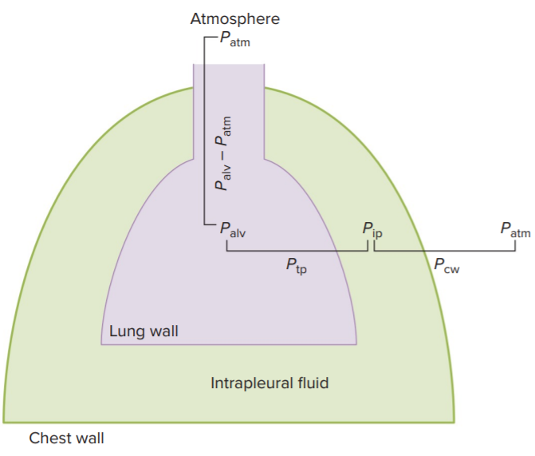

# 呼吸生理學

呼吸系統在交換氣體、調節酸鹼、發出聲音 (Phonation)、免疫功能、捕捉並溶解血栓、製造部份血小板 (待證實) 扮演重要角色。

## 1. 功能解剖學

- 上呼吸道 : 口鼻、咽 (pharynx)、喉 (larynx)
- 喉部延伸出一條氣管 (trachea)
- 氣管以下可分為 Conducting zone, Respiratory zone
  - Respiratory zone 具有肺泡 (alveoli)，可交換氣體
- 氣管分岔出左右兩條支氣管 (bronchus)
- 支氣管分出細支氣管 (bronchiole)
  - Terminal bronchiole 再分支出 Respiratory bronchiole
  - 從 Respiratory bronchiole 開始進入 Respiratory zone

- 肺泡由 Type I cells, Type II cells, 間質 (Interstitium) 和微血管構成
  - Type II cells 較圓 (Type I 較扁)，且分泌 surfactant
- 肺沒有肌肉，主要靠橫膈膜 Diaphragm 控制肺內的壓力而調控呼吸

## 2. 呼吸 (Ventilation)

### 定義

- 首先我們定義 Ventilation 是氣體之間的交換行為。Bulk flow 主導著氣體的流動。
  - $$F=\Delta P / R$$
  - F 為 Bulk flow, $\Delta P$ 為壓力差, R 為阻力
- 由上式我們知道，flow 的大小和壓力差成正比，和阻力成反比。
- 習慣上，定義呼吸生理學中的壓力的零位面為「該生物所在海拔之正常氣壓」
  - P = 0，代表的壓力香等於此海拔的氣壓
- 呼吸最重要的原則如下
  - 大氣壓和肺泡內的壓力差，決定空氣進去肺部或出去肺部
  - **吸氣時，肺泡壓力比大氣壓低 (負壓吸氣)**
  - **呼氣時，肺泡壓力比大氣壓高 (正壓呼氣)**
  - $P_{alv} - P_{atm} = 0$ 代表 airway 保持開啟，但不吸氣也不呼氣
- 哺乳動物利用肺泡體積的改變，去控制壓力的大小 (遵守波以耳定律)

### Transmural Pressures

有兩個很重要的 Transmural Pressures 保持肺部開啟、胸腔維持一定體積

- 首先我們要知道 chest wall, lung wall 是很有彈性的組織
  - chest wall 傾向於擴張。若無任何力量，chest wall 會擴張到非常大
  - lung wall 傾向於收縮。若無任何力量，肺泡會慢慢的全部塌陷
- 在 resting 的狀態下 (不吸氣不呼氣)，胸腔內液的壓力會比肺小一點點
  - 胸腔內液就會有點類似真空吸引一樣，把 lung wall 吸住不讓肺塌陷
    - $P_{tp} = P_{alv} - P_{ip} = +4\ mmHg$ (正號，傾向讓肺部變大)
  - 胸腔內液就會有點類似真空吸引一樣，把 chest wall 吸住不讓他無限擴張
    - $P_{cw} = P_{ip} - P_{atm} = -4\ mmHg$ (負號，傾向讓胸腔變小)

## 3. 呼吸基本原則

### 呼氣與吸氣

- 呼吸肌肉的收縮與舒張，主要是改變胸腔體積，讓 $P_{ip}$ 改變。
- $P_{ip}$ 改變，進而使肺部體積改變。$P_{alv}$ 改變，進而使 Flow 改變。
  - $P_{ip} - P_{alv}$ 決定肺部體積
- 負壓吸氣
  - 胸腔變大 → $P_{ip}$ 變小 → $P_{ip} - P_{alv}$ 更大 → 肺部被更強力的「真空吸引」
  - 肺部體積變大 →  $P_{alv}$ 變小 → 負壓吸氣
- 正壓呼氣
  - 胸腔變小 → $P_{ip}$ 變大 →  $P_{ip} - P_{alv}$ 變小 → 肺部的「真空吸引」力變小
  - 肺部體積變小 →  $P_{alv}$ 變大 → 正壓呼氣
- 呼吸相關肌肉的神經支配
  - 橫膈膜 : phrenic nerve
  - 肋間肌 : intercostal nerve

## 4. 肺部力學 (Lung Mechanics)

由 Lung Compliance、Airway Resistance、Lung Volumes and Capacities 決定

- Lung Compliance
  - 肺部表面伸張能力
  - 張力與 Surfactant 在呼吸運動的重要角色
    - Law of Laplace
      - 肺泡壓力與表面張力成正比，與肺泡半徑成反比
      - 空氣由高壓往低壓移動
    - 注意
      - 遵守「拉普拉斯定律」和「增加肺泡以增加氣體交換表面積」兩者矛盾
      - 物理定律傾向於讓肺泡全部融合，但是這樣表面積太小，不足以讓氣體交換。
- Airway Resistance
- Lung Volumes and Capacities 
  - Tidal Volume / Reserve Volume
    - tidal volume
      - 正常情況下吸氣與呼氣體積相同，呈現規律變化
    - inspiratory reserve volume
      - 肺部體積最大值 (強迫吸氣到最飽) - tidal volume 最大值
      - 除了潮氣容積的吸氣變化，你還能吸多少空氣。
    - expiratory reserve volume
      - tidal volume 最小值 - 肺部體積最小值 (強迫呼氣到快窒息)
      - 除了潮氣容積當中的呼氣變化，你還能呼出多少空氣
    - functional residual capacity
      - tidal volume 最小值
      - 代表正常狀態 (不強迫肺部吸器或呼氣) 下的肺部的保留氣體容積 (氣體不會排空)
    - residual volume
      - 肺部體積最小值 (強迫呼氣到快窒息)
      - 代表無論在什麼情況下，肺部至少會保留的氣體容積。也就是你用盡所有力氣呼氣後，肺部還剩下的空氣容積。(氣體不可能完全被排空)
    - vital capacity
      - 肺部體積最大值 (強迫吸氣到最飽) - 肺部體積最小值 (強迫呼氣到快窒息)
      - 也就是你最多可以呼出多少氣體 (包含潮氣容積的呼氣) 、吸入多少氣體的總和 包含潮氣容積的吸氣)
    - total capacity
      - 從 0 開始算，你的肺部最大可以撐到多大

## 5. 肺泡呼吸

- Dead Space
  - Anatomical dead space
    - conducting zone 體積
      - conducting zone 在吸氣與呼氣之間體積變化不會太大
      - conducting zone 中的空氣，並不參與肺泡氣體交換
    - [[生理學] CH 13. Anatomical dead space](evernote:///view/74909985/s435/f72f0d43-31e2-4ad4-a706-4fd568e95809/f72f0d43-31e2-4ad4-a706-4fd568e95809/)
  - Alveolar dead space
  - Physiology = Anatomical dead space + Alveolar dead space
- Alveolar ventilation

## 6. 氣體的交換

- 分壓平衡、血紅素親和力是最重要的決定性因素
  - 分壓平衡
    - bound O2 不再參與氣體平衡

## 7. 氣體的運輸

- 氧合血紅素的親和力變化
  - 向右移動 (圖形往 x 軸躺下去)
    - 飽和度下降，代表紅血球不喜歡氧氣
    - 飽和度下降的因素
      - 溫度上升
      - 二氧化碳分壓上升
      - 變酸
      - 加入 DPG
  - 飽和現象
    - limited number of binding sites
- 二氧化碳與 CA
  - 溶於血漿
  - 受 CA 催化，形成碳酸氫根
    - 紅血球內有 CA，催化以下反應
      - CO2 + H2O → H+ + HCO3-
    - HCO3- 進入血液，是透過與 Cl- 的交換
- 氫離子的傳輸
  - HbO2 + H+ ⇋ HbH + O2
  - 故 O2  分壓會決定 H+  濃度 (?
  - 無氧血紅素對於氫離子、二氧化碳親和力較高

## 8. 呼吸系統的調控

- **呼吸控制**
  - 中樞
    - 延腦
  - 調節中樞
    - 橋腦
  - 調節
    - 嚴重氧氣短缺才會造成過度換氣
    - CO2 分壓的小變化就可以影響換氣
      - CO2 分壓與換氣速率呈正相關
    - 無論 H+ 來源為何，血液中的 H+ 濃度變高，就會造成過度換氣
      - H+濃度與換氣速率呈線性關係
- **恆定性**
  - 受器
    - Peripheral
      - 主動脈
      - 頸動脈
      - 氧氣分壓
      - H+ 濃度
      - 二氧化碳分壓
    - Central
      - 腦脊髓液 (CSF) 的 H+ 濃度
    - Other
      - stretch receptors
      - J receptor
      - irritant receptors
  - 運動狀態
    - 開始運動時，呼吸速率會跳躍式上升，代表運動的時候 feedforward regulation 參與換氣速率的調控
    - 運動的時候，主要不是由分壓、H+ 濃度決定換氣速率
    - 運動完會有 oxygen debt

## 不正常功能、肺部功能指標

- **肺部功能指標**
  - FEV1、FVC
  - Ventilation-perfusion inequality (VQ inquality)
    - Ventilation 定義
- **依據氧氣分壓分類**
  - **Hypoxia (任何形式的組織缺氧)**
    - hypoventilation
      - a defect in respiratory control pathway
      - 胸腔不正常工作 (如氣胸)
      - 阻塞性
      - 中樞神經抑制性藥物
        - 鴉片類止痛劑
    - diffusion impairment
      - diffuse interstitial fibrosis
      - 如肺部纖維化 (?)
    - shunt
      - 有血液灌注，但是沒有空氣通過
        - (ventilation ÷ perfusion = 0)
        - (也就是 V/Q 比值)
      - 最常見的情況
        - 卵圓孔未閉合
        - 缺氧血沒有流進去肺泡中，或就是沒有經過有氧氣的肺泡
    - ventilation-perfusion inequality
      - 阻塞性肺部疾病
      - 其他肺部疾病
    - anemic hypoxia
      - 貧血性
    - ischemic hypoxia
      - 缺血性
    - histoxic hypoxia
      - 中毒性
- **依據原因分類**
  - obstructive lung disease
    - COPD
      - 肺氣腫 (emphysema)
        - 損失彈性組織和肺泡壁
        - 可能會導致吸氣的時候，體積過度增大；或是肺泡萎縮
        - leukocyte (白血球) 分泌蛋白酶破壞肺泡壁
        - 吸菸是最主要造成肺氣腫的因素
        - 屬於 COPD 的一種
        - 其他特徵
          - 肺泡融合
          - 增加呼吸道阻力
          - 有些部分破壞的較嚴重，有些卻沒有
            - 我的理解
              - 有些地方空氣變多、血液變少
              - 有些地方血液變多、空氣變少
            - 造成 vq inequality
      - 慢性支氣管炎
    - 氣喘 (不屬於 COPD)
  - restrictive lung disease
  - Respiratory distress in the newborn
  - 氣胸
- **Hyperventilation**

* * *

補充資訊

- 氧氣分壓表達的並不是氧氣含量
  - 因為氧氣被 bound 之後，就不再參與分壓平衡
  - 測分壓
    - 今天準備 760 torr 的 O2
    - 如果另一個瓶子當中的 O2 直接與此 760 torr 的 O2 達成平衡，代表兩瓶的 O2 分壓相同
  - 無論是哪種圖形，分壓代表的意義只是：「在平衡狀態下，某種氣體的分壓」而已
  - 我的猜想
  - 血液中的氧分壓若為 40 torr，就是指把這杯血放在 40 torr 的氧氣下，會達到動態平衡。
- 通氣、灌注
  - 通氣 = ventilation
    - ventilate = Cause air to enter and circulate freely in (a room, building, etc.)
  - 灌注 = perfusion
    - perfuse = Supply (an organ or tissue) with a fluid, typically treated blood or a blood substitute, by circulating it through blood vessels or other natural channels.
  - 查詢資料
    - [[生理學] 通氣與灌流差異，什麼是「分流 (shunt)」- - NEJS](http://jerryljw.blogspot.com/2016/04/shunt.html)
    - [Re- [問題] shunt和 V-Q mismarch - 看板 medstudent - 批踢踢實業坊](https://www.ptt.cc/bbs/medstudent/M.1245554212.A.9C6.html)
    - 我理解的版本
      - VQ mismatch 就是 VQ inequality
        - shunting 的定義是 VQ = 0，算是 VQ mismatch 的一種
- Venous Blood
  - venous blood 的意思須由上下文決定，有時是指缺氧血，有時是指靜脈血。
  - systemic venous blood 一定是指缺氧血 (?